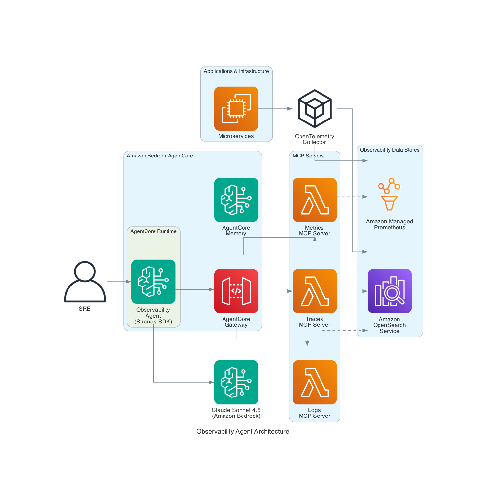

# Observability Agent with Amazon Bedrock AgentCore

An AI-powered observability agent that helps SREs investigate incidents and reduce Mean Time to Resolution (MTTR) using Amazon Bedrock AgentCore, OpenSearch Serverless, and Amazon Managed Prometheus.

[Get Started](#quick-start-build-from-scratch){: .btn .btn-primary .fs-5 .mb-4 .mb-md-0 .mr-2 }
[View on GitHub](https://github.com/aws-samples/sample-observability-agent-bedrock-agentcore){: .btn .fs-5 .mb-4 .mb-md-0 }

---

## Overview

When an incident triggers alerts, SREs typically jump between multiple dashboards, write specific queries, and correlate between logs and traces to find root cause. This process is largely manual and creates significant cognitive load.

This project implements an **observability agent** that automates incident investigation by querying logs, traces, and metrics, then providing root cause analysis with actionable recommendations.

Based on the architecture from [Reduce Mean Time to Resolution with an observability agent](https://aws.amazon.com/blogs/big-data/reduce-mean-time-to-resolution-with-an-observability-agent/) on the AWS Big Data Blog.

## Architecture



### Components

| Component | Purpose |
|:----------|:--------|
| **Amazon Bedrock AgentCore Runtime** | Hosts and executes the AI agent |
| **Amazon Bedrock AgentCore Memory** | Maintains conversation context across sessions |
| **Amazon OpenSearch Serverless** | Stores logs and distributed traces |
| **Amazon Managed Prometheus** | Stores infrastructure metrics |
| **Anthropic Claude Sonnet 4.5** | Provides reasoning capabilities |

### Agent Tools

| Tool | Data Source | Description |
|:-----|:-----------|:------------|
| `get_red_metrics` | OpenSearch (traces) | Rate, Error, Duration metrics aggregated by service |
| `search_logs` | OpenSearch (logs) | Search application logs by service and severity |
| `get_spans` | OpenSearch (traces) | Search distributed trace spans across services |
| `query_metrics` | Amazon Managed Prometheus | Query infrastructure metrics using PromQL |

---

## Choose Your Path

### Option A: Quick Start (Build from Scratch)

Best for: Learning, POC, testing the agent with sample data.

**Time:** ~15 minutes | **Cost:** ~$5/day for OpenSearch Serverless

### Option B: Integrate with Existing Infrastructure

Best for: Production use with your existing observability stack.

**Time:** ~10 minutes | **Prerequisites:** Existing OpenSearch + Prometheus

---

## Quick Start (Build from Scratch)

### Prerequisites

- AWS account with appropriate permissions
- Python 3.11+
- AWS CLI configured with credentials

### Step 1: Clone and Setup

```bash
git clone https://github.com/aws-samples/sample-observability-agent-bedrock-agentcore.git
cd sample-observability-agent-bedrock-agentcore

python -m venv .venv
source .venv/bin/activate  # On Windows: .venv\Scripts\activate
pip install -r requirements.txt
```

### Step 2: Create OpenSearch Serverless Collection

```bash
export AWS_ACCOUNT_ID=$(aws sts get-caller-identity --query Account --output text)
export AWS_REGION=us-east-1

# Create encryption policy
aws opensearchserverless create-security-policy \
  --name observability-enc --type encryption \
  --policy '{"Rules":[{"ResourceType":"collection","Resource":["collection/observability-agent"]}],"AWSOwnedKey":true}'

# Create network policy
aws opensearchserverless create-security-policy \
  --name observability-net --type network \
  --policy '[{"Rules":[{"ResourceType":"collection","Resource":["collection/observability-agent"]},{"ResourceType":"dashboard","Resource":["collection/observability-agent"]}],"AllowFromPublic":true}]'

# Create data access policy
aws opensearchserverless create-access-policy \
  --name observability-access --type data \
  --policy "[{\"Rules\":[{\"ResourceType\":\"collection\",\"Resource\":[\"collection/observability-agent\"],\"Permission\":[\"aoss:*\"]},{\"ResourceType\":\"index\",\"Resource\":[\"index/observability-agent/*\"],\"Permission\":[\"aoss:*\"]}],\"Principal\":[\"arn:aws:iam::${AWS_ACCOUNT_ID}:root\"]}]"

# Create collection
aws opensearchserverless create-collection \
  --name observability-agent --type SEARCH
```

Wait for the collection to become ACTIVE (~2-3 minutes):

```bash
aws opensearchserverless batch-get-collection --names observability-agent
```

### Step 3: Configure Environment

```bash
export OPENSEARCH_HOST=$(aws opensearchserverless batch-get-collection \
  --names observability-agent \
  --query 'collectionDetails[0].collectionEndpoint' \
  --output text | sed 's|https://||')
```

### Step 4: Generate Test Data

```bash
python scripts/generate_test_data.py
```

This creates sample logs and traces simulating a payment service failure with ~40% error rate.

### Step 5: Deploy the Agent

```bash
pip install bedrock-agentcore-starter-toolkit
agentcore configure --entrypoint agent/main.py --non-interactive
agentcore deploy
```

### Step 6: Grant Permissions

{: .warning }
The AgentCore execution role needs access to OpenSearch Serverless. Get the role name from the deploy output.

```bash
export AGENTCORE_ROLE=AmazonBedrockAgentCoreSDKRuntime-us-east-1-XXXXXX
export COLLECTION_ID=$(aws opensearchserverless batch-get-collection \
  --names observability-agent \
  --query 'collectionDetails[0].id' --output text)

# Add OpenSearch permissions
aws iam put-role-policy \
  --role-name $AGENTCORE_ROLE \
  --policy-name OpenSearchServerlessAccess \
  --policy-document "{
    \"Version\": \"2012-10-17\",
    \"Statement\": [{
      \"Effect\": \"Allow\",
      \"Action\": [\"aoss:APIAccessAll\"],
      \"Resource\": \"arn:aws:aoss:${AWS_REGION}:${AWS_ACCOUNT_ID}:collection/${COLLECTION_ID}\"
    }]
  }"

# Update data access policy to include the role
POLICY_VERSION=$(aws opensearchserverless get-access-policy \
  --name observability-access --type data \
  --query 'accessPolicyDetail.policyVersion' --output text)

aws opensearchserverless update-access-policy \
  --name observability-access --type data \
  --policy-version $POLICY_VERSION \
  --policy "[{\"Rules\":[{\"ResourceType\":\"collection\",\"Resource\":[\"collection/observability-agent\"],\"Permission\":[\"aoss:*\"]},{\"ResourceType\":\"index\",\"Resource\":[\"index/observability-agent/*\"],\"Permission\":[\"aoss:*\"]}],\"Principal\":[\"arn:aws:iam::${AWS_ACCOUNT_ID}:root\",\"arn:aws:iam::${AWS_ACCOUNT_ID}:role/${AGENTCORE_ROLE}\"]}]"
```

### Step 7: Test the Agent

```bash
sleep 30  # Wait for IAM propagation

# Health check — uses get_red_metrics to show Rate/Error/Duration per service
agentcore invoke '{"prompt": "Give me a health overview of all my services"}'

# Error investigation — uses search_logs + get_red_metrics to find errors
agentcore invoke '{"prompt": "Are there any errors in my application?"}'

# Service deep dive — uses get_spans + search_logs to trace failures
agentcore invoke '{"prompt": "What is wrong with the payment service? Show me the error traces"}'

# Trace correlation — uses get_spans + search_logs to follow a request across services
agentcore invoke '{"prompt": "Find a failed trace and show me the full request flow across all services"}'

# Metrics query — uses query_metrics to check infrastructure health
agentcore invoke '{"prompt": "Query prometheus for CPU and memory metrics"}'

# Root cause analysis — agent combines all tools to investigate
agentcore invoke '{"prompt": "Our checkout is failing for some users. Investigate the root cause and suggest fixes"}'
```

---

## Integrate with Existing Infrastructure

### Step 1: Clone and Setup

```bash
git clone https://github.com/aws-samples/sample-observability-agent-bedrock-agentcore.git
cd sample-observability-agent-bedrock-agentcore

python -m venv .venv
source .venv/bin/activate
pip install -r requirements.txt
```

### Step 2: Configure Your Endpoints

```bash
export OPENSEARCH_HOST=your-collection-id.us-east-1.aoss.amazonaws.com
export AMP_WORKSPACE_ID=ws-xxxxxxxx-xxxx-xxxx-xxxx-xxxxxxxxxxxx  # Optional
export AWS_REGION=us-east-1
```

### Step 3: Customize Index Patterns (if needed)

If your indices use different naming conventions, update the index patterns in `agent/main.py`:

```python
# Default patterns (OpenTelemetry standard)
"otel-v1-apm-span-*"  # For traces
"otel-logs-*"          # For logs
```

### Step 4: Deploy and Grant Permissions

```bash
pip install bedrock-agentcore-starter-toolkit
agentcore configure --entrypoint agent/main.py --non-interactive
agentcore deploy
```

Then add the AgentCore role to your OpenSearch data access policy (see Step 6 in Quick Start).

### Step 5: Test

```bash
agentcore invoke '{"prompt": "Show me the health of my services"}'
```

---

## Security

This sample follows AWS security best practices:

- **No hardcoded credentials** — Uses IAM roles for all authentication
- **TLS everywhere** — All connections use HTTPS with certificate verification
- **Input validation** — All tool inputs are validated and sanitized
- **Least privilege** — IAM policies grant minimal required permissions
- **Query limits** — Result sizes and query lengths are capped

---

## Clean Up

{: .warning }
OpenSearch Serverless incurs charges while active (~$5/day). Delete resources when done.

```bash
agentcore destroy

aws opensearchserverless delete-collection --id YOUR_COLLECTION_ID
aws opensearchserverless delete-security-policy --name observability-enc --type encryption
aws opensearchserverless delete-security-policy --name observability-net --type network
aws opensearchserverless delete-access-policy --name observability-access --type data
```

---

## About

This project is maintained by [AWS Samples](https://github.com/aws-samples) and licensed under the [MIT-0 License](https://github.com/aws-samples/sample-observability-agent-bedrock-agentcore/blob/main/LICENSE).

### Contributing

Contributions are welcome! See [CONTRIBUTING.md](https://github.com/aws-samples/sample-observability-agent-bedrock-agentcore/blob/main/CONTRIBUTING.md) for guidelines.

### References

- [AWS Blog: Reduce MTTR with an Observability Agent](https://aws.amazon.com/blogs/big-data/reduce-mean-time-to-resolution-with-an-observability-agent/)
- [Amazon Bedrock AgentCore Documentation](https://docs.aws.amazon.com/bedrock-agentcore/latest/devguide/)
- [Strands Agents SDK](https://strandsagents.com/latest/documentation/docs/)
- [Amazon OpenSearch Serverless](https://docs.aws.amazon.com/opensearch-service/latest/developerguide/serverless.html)
